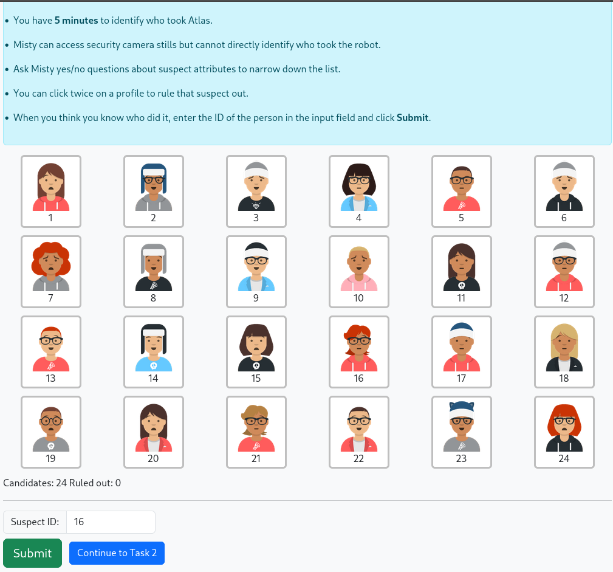
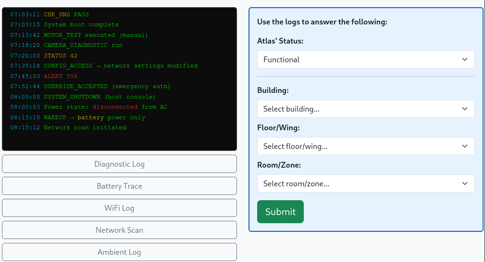

```{r}
library(tidyverse)
library(janitor)
library(scales)
library(corrplot)
library(sjPlot)
library(ggstatsplot)
library(psych)
library(performance)
library(gt)
library(Hmisc)
library(haven)
library(gtsummary)

session_df <- readRDS("full_session_data.rds")
survey_df <- readRDS("survey_data.rds") |>
  arrange(post_date)

set_gtsummary_theme(theme_gtsummary_journal("nejm"))
set_gtsummary_theme(theme_gtsummary_compact())

dialogue_turns <- read_csv(
  '/home/sheron/Documents/misty-paper/data/clean_data/dialogue_turns_filtered.csv'
) |>
  filter(
    session_id == 'P51' |
      session_id == 'P36' |
      session_id == 'P36' |
      session_id == 'P41'
  )

bad_turns <- read_csv(
  '/home/sheron/Documents/misty-paper/data/clean_data/dialogue_turns_filtered.csv'
) |>
  filter(
    session_id == 'P14' |
      session_id == 'P17' |
      session_id == 'P30' |
      session_id == 'P32'
  )

dialogue_session_summary <- read_csv(
  'data/analysis_output/final_dialogue_summary.csv'
) |>
  mutate(
    exclusions = if_else(
      mean_comm_breakdown > .6,
      'exclude',
      'include'
    )
  ) |>
  select(
    session_id,
    -n_turns,
    contains('prop'),
    n_stage_skipped,
    n_task_turns,
    contains('burden'),
    contains('viability'),
    exclusions
  )

df_flat_scores_final <- readRDS("full_dataset_with_items.rds") |>
  left_join(dialogue_session_summary, by = join_by(session_id)) #|>
#mutate(
#  post_trust = scales::rescale(
#   post_trust,
#   to = c(0, 100),
#   from = c(1, 5)
# )
# ) #|>
#filter(exclusions != 'exclude')

df_long_scores_final <- readRDS("full_dataset_long_trust_post.csv") |>
  left_join(dialogue_session_summary, by = join_by(session_id)) #|>
# filter(exclusions != 'exclude')

# "P14" "P17" "P30" "P32" "P46" "P47" "P50"

##  • Affect-adaptive robot interaction policy increased post-collaboration trust• Affective trust degraded faster than perceived reliability under communication failure• Proactive responsiveness enhanced trust in AI-driven human-robot collaboration• Fully autonomous HRI study reveals real-world interaction breakdowns

## Highlights

#- Robots that adapt to users are rated more trustworthy than robots that only react
#- Unprompted help and empathy from robots builds greater collaboration trust
#- Trust advantages of responsive robots disappear when communication breaks down
#- Affective trust breaks down faster than perceived reliability when communication fails
```

## Introduction

As artificial intelligence (AI) technologies advance, they are increasingly integrated into robotic systems, enabling more adaptive, autonomous, and context-sensitive behaviour in real-world environments. This convergence has accelerated the deployment of robots across safety-critical domains such as manufacturing [@choi2025], mining [@fu2021], and healthcare [@ciuffreda2025], where robots are now expected to operate alongside humans rather than in isolation [@diab2025; @spitale2023]. In these collaborative settings, successful deployment depends not only on technical performance and safety guarantees, but also on whether human users are willing to rely on, communicate with, and coordinate their actions around robotic partners [@campagna2025; @emaminejad2022]. Trust has therefore emerged as a central determinant of adoption and effective use in human-robot collaboration (HRC) [@wischnewski2023; @campagna2025]. Insufficient trust can lead to disuse or rejection of automation, while excessive trust risks overreliance and accidents—particularly in environments characterized by uncertainty or incomplete information [@devisser2020].

In HRC, trust is commonly understood as a willingness to rely on an agent under conditions of uncertainty and risk [@muir1994; @hancock2011]. This reliance is dynamically calibrated, shaping how closely users monitor a robot, when they intervene, and whether they defer or override its actions. Appropriately calibrated trust supports effective coordination, whereas under-trust may result in disengagement or redundant oversight, and over-trust can lead to inappropriate reliance and unsafe outcomes [@devisser2020]. These dynamics are especially pronounced in dialogue-driven collaborative tasks, where misunderstandings, delays, or ambiguous responses may directly influence users’ ongoing assessments of a robot’s competence and reliability.

A substantial body of human-robot interaction (HRI) research has examined how robot behaviour influences user trust, perceived reliability, and cooperation across industrial and social contexts [@shayganfar2019; @fartook2025]. Trust is typically conceptualized as a multidimensional construct encompassing cognitive evaluations of competence, predictability, and reliability, alongside a behavioural willingness to collaborate toward shared goals under conditions of risk or uncertainty [@muir1994; @hancock2011; @devisser2020]. Despite this multidimensional framing, empirical studies have most often operationalized trust using post-interaction self-report questionnaires collected following short, highly controlled, and often scripted interactions. While such measures provide valuable global assessments of user attitudes, they offer limited insight into how trust is negotiated, disrupted, and repaired during ongoing interaction—particularly in autonomous systems where errors and ambiguities are unavoidable [@maure].

Studying trust as an interactional process therefore requires experimental settings in which users engage with robots that exhibit both adaptive behaviour and realistic system limitations [@campagna2025]. In such settings, trust is shaped not only by task success but by how robots handle uncertainty, errors, and misalignment during interaction. Fully autonomous systems, where dialogue management and response generation occur without human intervention, provide a critical testbed for examining these dynamics, as they expose users to the same constraints and breakdowns encountered in real-world deployment [@campagna2025].

Yet in practice, much of the existing HRI trust literature has relied on scripted behaviours, simulated environments, or Wizard-of-Oz paradigms in which a human operator covertly manages the robot’s behaviour [@bettencourt2025; @campagna2025]. While these approaches are valuable for isolating specific design factors, they obscure the interaction breakdowns and system imperfections that characterize deployed autonomous robots. Limitations such as speech recognition errors, delayed responses, misinterpretations of user intent, and incomplete affect sensing are not peripheral issues but defining features of real-world interaction. These failures are likely to play a decisive role in shaping trust and collaboration, yet remain underrepresented in empirical evaluations [@campagna2025].

Within HRI, a range of design strategies have been proposed to support appropriate trust calibration during collaboration, including robot appearance [@nicolas2021], transparency cues [@zhang2019], explanations of system intent, adaptive feedback [@val-calvo2020], and interaction pacing [@kok2020]. Many of these approaches aim to help users form accurate expectations about a robot’s capabilities and limitations, particularly in contexts involving uncertainty or partial observability. Among these strategies, adaptive interaction behaviour—how and when a robot responds to user state and task context—has been identified as a particularly influential factor in shaping perceptions of competence, reliability, and collaboration [@fartook2025].

Recent advances in AI have expanded the range of interaction strategies available to autonomous robotic platforms in practice, enabling systems to move beyond fixed, scripted behaviours toward adaptive interaction policies that respond to user state and task context in real time [@atone2022]. Improvements in spoken-language processing, dialogue state tracking, and large language model-based reasoning now allow robots to adjust not only what they say, but when and how assistance is provided during collaboration [@wei]. In parallel, advances in affect inference from language and interaction cues have made it increasingly feasible for robots to incorporate estimates of user emotional state into interaction management [@mcduff; @spitale2023]. As a result, responsiveness in contemporary HRI is increasingly understood as a property of an underlying interaction policy, governing how a robot interprets cues, initiates support, and manages uncertainty, rather than as a surface-level social behaviour [@birnbaum2016; @shayganfar2019; @fartook2025].

From an engineering perspective, responsiveness in autonomous human-robot interaction is not implemented as a single behavioural rule or surface-level cue, but emerges from the coordination of multiple system components responsible for perception, interpretation, and action [@arkin2003]. In practice, responsive behaviour depends on the integration of dialogue management, state tracking, and inference mechanisms that estimate task progress, interaction uncertainty, and user affect. Proactive assistance based on this integrated state representation differs fundamentally from reactive, request-based behaviour; for example, a robot may offer clarification, encouragement, or pacing adjustments when confusion, hesitation, or frustration is inferred, rather than waiting for an explicit request for help [@birnbaum2016].

Implementing such behaviour requires autonomous systems to manage spoken-language dialogue, maintain interaction state over time, and coordinate verbal and nonverbal responses in real time, all while operating under noise, latency, and sensing uncertainty [@campagna2025]. As a result, responsiveness in deployed systems reflects properties of the overall interaction architecture, not merely the presence or absence of adaptive dialogue. Despite growing interest in responsive and affect-aware robots, relatively little empirical work has examined how such integrated interaction systems operate under fully autonomous conditions, or how their behaviour shapes trust and collaboration when communication breakdowns cannot be externally repaired [@campagna2025].

The present pilot study addresses these gaps by examining trust and collaboration during in-person interaction with a fully autonomous social robot in which participants collaborated with one of two versions of the same robot platform during a dialogue-driven puzzle task requiring shared problem solving. In both conditions, all interaction management, including speech recognition, dialogue state tracking, task progression, and response generation was handled and logged autonomously by a centralized dialogue agent without human intervention. In the responsive condition, the robot employed a proactive, affect-aware interaction policy, adapting its assistance based on conversational cues and inferred user affect (e.g., frustration or engagement). In the neutral condition, the robot followed a reactive policy, providing basic guidance and periodic check-ins, otherwise providing assistance only when explicitly requested.

The pilot study had three primary objectives: (1) to design and evaluate the feasibility of an autonomous spoken-language interaction system with affect-responsive behaviour on a mobile robot platform; (2) to assess whether a responsive interaction policy influences post-interaction trust and collaborative experience under autonomous conditions; and (3) to explore how behavioural and interaction-level indicators align with subjective trust evaluations. 

Rather than optimizing for flawless interaction, this pilot study prioritizes feasibility assessment and mechanism exploration over confirmatory hypothesis testing. The sample size is modest, interaction conditions subject to real-world autonomy constraints, and final condition assignment was not fully randomized due to participant attrition. Accordingly, results should be interpreted as exploratory evidence regarding how interaction policy shapes trust under autonomous spoken-language collaboration, and as guidance for the design of larger, confirmatory studies. The findings are intended to inform the design of a larger subsequent study by evaluating feasibility and identifying technical, interactional, and methodological challenges that must be addressed when evaluating affect-responsive robots in real-world contexts.

## Methods

This study employed a between-subjects experimental design to examine how robot interaction policy influences trust and collaboration during fully autonomous, in-person human-robot interaction. The sole experimental factor was the robot’s interaction policy. Participants were initially randomly assigned to condition; however, final condition allocation was partially constrained by participant attrition and scheduling, as described below.

Throughout this paper, references to “the robot” denote the autonomous interactive system comprising the Misty-II hardware platform and an integrated offboard software pipeline [@mistyrobotics]. Spoken-language understanding, dialogue management, task logic, and interaction policy execution were handled on an external edge device which interfaced with the robot via websocket interfaces. The Misty-II platform was responsible for audio capture, text to speech, and the execution of embodied behaviours including facial expressions, body movement, and LED signalling. Despite this distributed execution, all interaction decisions were generated autonomously by an AI driven centralized dialogue agent responsible for coordinating spoken-language understanding, task state, and verbal and nonverbal behaviour based on the interaction policy. More detail on the robot platform and software architecture is provided in Appendix A.

### Study Protocol

Participants signed up for the study, provided informed consent, were randomly assigned to a group, and completed a pre-session questionnaire before their in-person session via a survey hosted on Qualtrics. The elapsed time between sign-up and the in-person session was at most a week and at minimum immediately before the session. The pre-session questionnaire collected basic demographics information and assessed baseline characteristics, including the Negative Attitudes Toward Robots Scale (NARS) and the short form of the Need for Cognition scale (NFC-s) [@nomura; @cacioppo1982]. These measures were used to capture a baseline of individual differences that may moderate responses to robot interaction.

In-person sessions were conducted in a quiet, private room at Laurentian University between November and December 2025. Prior to each session, the robot’s interaction policy was configured to the assigned experimental condition.

Upon arrival, participants were greeted by the researcher, provided with a brief overview of the session, and given instructions for effective communication with the robot. Once participants indicated readiness, the researcher exited the room, leaving the participant and robot to complete the interaction without human presence or observation (see @fig-task1). Participants initiated the interaction by clicking a start button on the interface and were informed that they could terminate the session at any time without penalty.

{#fig-setup fig-align="center" width="420"}

Following task completion, participants completed a 21-item post-interaction questionnaire assessing trust on a provied laptop. Participants then engaged in a brief debrief with the researcher and were awarded a \$15 gift card. Total session duration averaged approximately 30 minutes.

### Interaction Policies

Across both tasks, interaction behaviour was governed by one of two interaction policies that differed in how the robot was intended to initiate, frame, and adapt its contributions during collaboration. Under both policies, the robot continuously monitored interaction timing and issued brief check-ins following extended periods of participant silence in order to preserve interaction continuity. In the neutral, reactive condition, these check-ins were minimal and task-focused, serving only to signal availability without providing guidance, encouragement, or additional framing (e.g., "I'm ready for your next question.").

In contrast, under the responsive policy, the robot’s utterances were affectively framed and context-sensitive. In addition to answering questions, the robot proactively adapted its dialogue, assistance, and repair strategies based on inferred interaction state, such as hesitation, frustration, or apparent difficulty. This included acknowledging task difficulty, offering encouragement, and proposing collaborative reasoning (e.g., "I can tell you're frustrated, don't worry! we can reason through this together"), rather than waiting for an explicit request for help. Beyond differences in check-in style, the responsive robot also initiated guidance or clarification when interaction stagnated, whereas the neutral robot limited its contributions to basic task guidance and direct queries.

Both conditions operated fully autonomously without human intervention and otherwise used the same underlying task logic and sensing infrastructure.

### Collaborative Task Design

The task structure was modelled after the interactive and immersive puzzle game design by @lin2022 to examine collaboration under two distinct dependency conditions: enforced collaboration, in which successful task completion required the robot’s involvement, and optional collaboration, in which participants could choose whether and how to engage the robot. To operationalize these conditions in a naturalistic way, we embedded both tasks within a single immersive, narrative-driven puzzle scenario.

Participants were positioned as investigators searching for a missing laboratory robot named Atlas. The Misty-II robot served as a diegetic guide and collaborative partner throughout the session, framing each stage of the interaction as part of the unfolding investigation. This narrative structure provided continuity across tasks while allowing the dependency manipulation to vary between stages without disrupting immersion. The full session lasted approximately 25 minutes and consisted of five sequential stages, including two timed reasoning tasks.

Interactions took place in a shared physical workspace that included the Misty-II social robot and a participant-facing computer interface [@mistyrobotics] at Laurentian University. The interface displayed task materials, recorded participant responses, and supported progression through the game. Importantly, it did not function as a control mechanism for the robot. Instead, the robot autonomously monitored task progression and participant inputs via the interface, adapting its dialogue and behaviour accordingly.

The interaction began with a brief greeting phase during which the robot introduced itself and engaged in rapport-building dialogue (e.g., “Hi, I’m Misty. What’s your name?”). This was followed by a mission briefing outlining the investigative scenario and establishing the collaborative goal: to determine who had taken Atlas and where it might now be located.

Participants then completed two core task stages. The first was a robot-dependent collaborative reasoning task in which Misty’s participation was required to solve the problem. The second was a more open-ended and complex problem-solving task in which robot assistance was available but not required. The interaction concluded with a wrap-up stage in which the robot provided closing feedback and formally ended the session.

Participants advanced between stages using the interface, either in response to the robot’s prompts or at their own discretion. All spoken dialogue and interaction events were managed autonomously by the robot and logged automatically for analysis.

#### Task 1: Robot-Dependent Collaborative Reasoning

In the first task, participants were asked to identify who had taken the missing robot from a 6 × 4 grid of 24 potential “suspects.” Within the narrative, Misty informed participants that she had access to internal security footage but was unable to directly reveal the suspect’s identity due to laboratory security protocols. Instead, she could answer only yes/no questions about observable features of the individual in the footage (e.g., “Was the suspect wearing a hat?”). This constraint established the robot as the sole source of task-relevant information while maintaining narrative plausibility. The suspect grid was displayed on the interface and allowed participants to click on and grey out eliminated candidates, while all questions were posed verbally to the robot (see @fig-task1).

The robot possessed the ground-truth information necessary to answer each question correctly. Successful task completion was therefore fully dependent on interaction with the robot, creating an enforced collaborative dynamic. Participants were required to coordinate a questioning strategy that progressively eliminated candidates based on shared features, narrowing the search space within a five-minute time limit. Efficient performance depended on selecting informative questions (i.e., features that divided the remaining candidates), tracking eliminations, and adapting subsequent questions based on prior answers.

{#fig-task1 fig-align="center" width="420"}

This structure made the task sensitive to interaction quality. Inefficient questioning, repeated queries, or uncertainty about next steps could slow progress and increase cognitive load, whereas effective coordination supported rapid elimination and convergence on a solution. The constrained yes/no format ensured consistent informational bandwidth across participants and conditions, while still allowing meaningful variation in collaboration strategy. The robot’s behaviour under the responsive policy was designed to support this process by providing adaptive guidance, encouragement, and clarification when participants appeared to struggle or become disengaged, whereas the neutral robot provided only direct answers without additional support.

#### Task 2: Open-Ended Collaborative Problem Solving

The second task involved a more open-ended reasoning challenge designed to shift the dependency structure from enforced to optional collaboration. Participants were presented with multiple technical logs through a simulated terminal interface that could be used to infer the location of the missing robot. The task was intentionally cryptic and difficult to solve within the allotted ten minutes without synthesizing information across multiple sources.

The logs contained partial and indirect clues related to the robot’s activity, such as wireless connectivity records, sensor readings, and timestamped system events. Solving the task required participants to identify which logs were relevant, extract spatial or temporal cues, and integrate these signals to progressively narrow down plausible locations. As in Task 1, successful performance depended on managing uncertainty and iteratively refining hypotheses rather than on recognizing a single explicit cue.

Critically, unlike Task 1, the robot did not possess ground-truth information about the solution or direct access to the contents of the logs. This constraint was intentional: Misty’s assistance was limited to general reasoning support derived from its language model, such as explaining how to interpret log formats, suggesting strategies for cross-referencing timestamps, or prompting participants to reconcile inconsistencies across sources. Participants could complete the task independently or solicit assistance from the robot at their discretion [@lin2022], allowing collaboration to emerge voluntarily rather than being structurally enforced.


```{r}
tbl1 <- dialogue_turns |>
  filter(session_id == "P41") #|>
#select()

# {#fig-task2 fig-align="center" width="400"}
```

### Measures

A combination of self-report and objective measures was used to assess trust, engagement, and task performance.

#### Self-Report Measures

Participants completed a pre-session questionnaire assessing baseline characteristics, including the Negative Attitudes Toward Robots Scale (NARS) and the short form of the Need for Cognition scale (NFC-s) [@cacioppo1982; @nomura]. These measures were used to capture a baseline of individual differences that may moderate responses to robot interaction.

Trust was assessed using two established self-report instruments commonly used in human-robot interaction research: the Trust Perception Scale-HRI (TPS-HRI) and the Trust in Industrial Human-Robot Collaboration scale (TI-HRC) [@schaefer2016; @charalambous2016]. Both measures were adapted to reflect the specific dialogue-driven task context and interaction modality of the present study, while preserving the original constructs and response intent of each scale. 9 items were retained from the TI-HRC and 12 items from the TPS-HRI. Item wording was modified to reference the robot’s behaviour during the dialogue-driven collaborative tasks and response formats were adjusted to ensure interpretability for participants without prior robotics experience (see Appendix B for a full item list). Internal consistency of the adapted trust measures was evaluated within the present sample to assess measurement reliability under the modified wording and response formats. Given the pilot sample size, reliability estimates should be interpreted cautiously, but are reported to provide transparency regarding scale performance under fully autonomous interaction conditions.

All self-report scales demonstrated acceptable to strong internal consistency in the present sample. The Negative Attitudes Toward Robots scale (NARS) showed good reliability ($\alpha$ = .81), with subscale alphas ranging from .72 to .76. The Need for Cognition scale (NFC) demonstrated strong internal consistency ($\alpha$ = .87). Both post-interaction trust measures also exhibited high reliability. The Trust Perception Scale-HRI (TPS-HRI) showed strong internal consistency overall ($\alpha$ = .89), with subscale reliabilities ranging from .74 to .88. The Trust in Industrial Human-Robot Collaboration scale (TI-HRC) demonstrated very high internal consistency ($\alpha$ = .95). 

Together, these instruments capture complementary dimensions of trust, including perceived reliability, task competence, and affective comfort. However, they differ in their conceptual emphasis: the TPS-HRI primarily operationalizes trust as a reflective judgement of system performance (i.e., "What percent of the time was the robot reliable"), whereas the TI-HRC scale emphasizes trust as an experienced, embodied response arising during interaction (i.e., "The way the robot moved made me feel uneasy"). Despite this complementarity, both measures rely on retrospective self-report and may be insensitive to moment-to-moment trust dynamics as collaboration unfolds. For this reason, questionnaire data were interpreted alongside behavioural and interaction-level measures.

#### Objective Measures

Self-report measures were complemented by objective interaction metrics derived from system logs and manually coded dialogue transcripts. These measures captured the behavioural and process-level dynamics of collaboration, including interaction timing, task performance, speech recognition quality, and the quality of spoken-language exchange are aspects of the interaction that self-report 
alone would not fully characterise.

Coded metrics were derived from interaction logs and manually coded dialogue transcripts. For the purposes of dialogue coding, a turn was defined as a participant utterance and the robot's subsequent response, treated as a single exchange unit. @tbl-post-dialogue-turns outlines objective task metrics including the average number of dialogue turns, session duration, response time (robot dialogue latency), and the number of engaged versus frustrated responses the robot detected — all obtained from log data. Coded metrics from manual transcript analysis included the proportion of turns characterized by communication breakdowns — defined as turns in which the ASR pipeline returned fragmented or linguistically incoherent output that prevented the robot from extracting sufficient content to respond meaningfully. This definition excludes silent turns, in which no speech was detected within a given timeframe and the robot issued a condition-appropriate check-in; silence was treated as a distinct interaction event and coded separately. Other coded metrics included human and robot reasoning, robot helpful and unhelpful guidance, robot and human affective engagement, and other task-relevant human and robot contributions. See Appendix C for a full coding scheme.

### Participants {#sec-participants}

A total of 29 participants were recruited from the Laurentian University community via word of mouth and the SONA recruitment system. Eligibility criteria required being 18 years or older, fluent in spoken and written English, and having normal or corrected-to-normal hearing and vision. Participants received a \$15 gift card as compensation for their time; some students additionally received partial credit for participating depending on their program of study. All procedures were approved by the Laurentian University Research Ethics Board (ROMEO File: #6021966).

Although English fluency was an eligibility requirement, in-person sessions revealed meaningful variability in participants' functional spoken-language proficiency that was not captured in the online screening stage. In several sessions, the researcher observed difficulty in communication with participants prior to the robot interaction; suggesting that self-reported or screener-assessed fluency did not always reflect the level of spoken-language proficiency required for real-time autonomous speech recognition. Given the spoken-language demands of the task, the researcher documented these observations in session notes as a methodological record, in anticipation of potential downstream effects on interaction quality.

Subsequent review of interaction transcripts and system logs confirmed that a subset of sessions exhibited severe and sustained communication failure, characterized by fragmented or unintelligible ASR output and stalled dialogue. In these sessions, the robot was unable to extract sufficient linguistic content to establish a conversation, respond meaningfully to participant input, or support task progression. These interaction failures are described in detail in the Analytic Strategy and Results sections.

#### Randomization Check

Participants were initially assigned to the responsive or control condition by Qualtrics using an automated randomization procedure at the time of sign-up. However, because several scheduled participants did not attend their in-person session, replacement participants were assigned to the next available session slot rather than re-randomized. As a result, the final condition assignment should be considered semi-random rather than strictly randomized.

To assess whether this deviation introduced systematic bias, we conducted randomization checks comparing participants across conditions on key baseline variables. Across analyses, participants in the responsive and control conditions were comparable with respect to demographic characteristics, prior experience with robots, and baseline attitudes toward robots, including gender, age, Negative Attitudes Toward Robots (NARS), and Need for Cognition scores (see @tbl-pre)[@cacioppo1982]. These patterns were consistent across both the eligible and full analytic samples, suggesting that the final group composition remained well balanced despite the partial breakdown of the intended randomization procedure.

```{r}
#| label: tbl-pre
#| tbl-cap: "Baseline participant characteristics by interaction policy (full sample)"
df_flat_scores_final |>
  #filter(exclusions != 'exclude') |>
  mutate(age = as_factor(age)) |>
  data.frame() |>
  select(-post_date) |>
  droplevels() |>
  select(
    group,
    gender,
    age,
    program,
    robot_xp,
    native_english,
    nars_pre,
    #nars_social_influence_robots,
    #nars_emotion_robots,
    #nars_interaction_robots,
    nfc_pre,
    #robot_trust_pre,
    #ai_trust_pre,
    #human_trust_pre
    #contains('trust')
    #-mytrust_pre
    exclusions
  ) |>
  tbl_summary(
    by = group,
    type = list(
      nars_pre ~ 'continuous',
      nfc_pre ~ 'continuous'
    ),
    statistic = list(
      all_continuous() ~ "{mean} ({sd})",
      all_categorical() ~ "{n} / {N} ({p}%)"
    ),
    label = list(
      gender ~ "Gender",
      age ~ "Age Group",
      program ~ "Program",
      robot_xp ~ "Experience with Robots",
      native_english ~ 'Native English Speaker',
      nfc_pre ~ 'Need for Cognition',
      nars_pre ~ "NARS Overall",
      exclusions ~ "Dialogue Viability"
      # nars_social_influence_robots ~ "NARS: Social Influence",
      #nars_emotion_robots ~ "NARS: Emotions",
      # nars_interaction_robots ~ "NARS: Interaction"
    ),
    missing = "no"
  ) |>
  add_n() |>
  add_p() |>
  #add_overall() |>
  bold_p() |>
  bold_labels() |>
  modify_caption(
    "Baseline participant characteristics by interaction policy (full sample)"
  ) #|>
#as_kable()
```

### Analytic Strategy

Analyses were structured to explicitly account for interaction viability, given the spoken-language demands of the task and the variability in communication quality observed across sessions (see @sec-participants). Sessions were classified as non-viable when severe communication breakdown prevented sustained dialogue between the participant and the robot, rendering the experimental manipulation inoperative.

Communication viability was operationalized using a dialogue-level metric derived from manual coding of system logs. For each session, the proportion of dialogue turns affected by speech-recognition failure (i.e., fragmented or unintelligible utterances) was computed. For the purposes of dialogue coding, a turn was defined as a participant utterance and the robot's subsequent response, treated as a single exchange unit. Sessions in which more than 60% of dialogue turns were affected were classified as non-viable, reflecting cases in which spoken-language interaction could not be meaningfully sustained. This criterion closely aligned with sessions independently flagged by the researcher during administration. It should be noted that because communication viability may itself be influenced by interaction policy, excluding non-viable sessions may have introduced selection bias and inflated estimated policy effects.

For this reason, analyses were conducted using three complementary approaches. Primary analyses were performed on an eligible sample excluding non-viable sessions, reflecting interactions in which the spoken-language protocol and experimental manipulation operated as intended. Full-sample analyses including all sessions were conducted as sensitivity checks. Finally, mechanism-focused analyses compared viable and non-viable sessions on interaction-process metrics (e.g., ASR failure rates, dialogue turn completion, task abandonment) to characterise how severe communication breakdown alters interaction dynamics. Trust measures from non-viable sessions were not interpreted as valid estimates of human-robot trust under functional interaction, as the robot was unable to sustain dialogue or collaborative behaviour in these cases. 

All analyses were conducted using R (version 4.5.1) within the Quarto framework. Data manipulation and visualization utilized the tidyverse suite of packages [@wickham2019], with mixed-effects models fitted using the lme4 and lmerTest packages [@bates2015; @kuznetsova2017] while Bayesian hierarchical models were fitted using the brms package [@burkner2018]. Summary tables were generated using the gtsummary package [@sjoberg2021]. 

## Results

Of the 29 completed sessions, 5 met the pre-specified criterion for non-viable interaction due to severe and persistent communication failure. These sessions were characterized by high rates of ASR failure, incomplete dialogue sequences, and skipped task stages. Primary results are therefore reported for the eligible sample (n = 24), with full-sample and mechanism-focused analyses reported as sensitivity and exploratory analyses, respectively.

```{r}
post_table <- df_flat_scores_final |>
  select(group, contains('post'), contains('correct'), exclusions, 63:90) |> #76
  data.frame() |>
  mutate(across(
    contains('post_trust'),
    ~ scales::rescale(.x, to = c(0, 100), from = c(1, 5))
  )) |>
  select(
    -post_date
  )
```

### Descriptive Analysis: Eligible Sample

Simple descriptive comparisons of post-interaction trust measures indicated higher trust ratings in the responsive condition relative to the control condition across both trust scales (see @tbl-post-eligible). As @fig-post-eligible shows, average post-interaction scores differed by approximately 18 points between conditions on both the Trust in Industrial Human-Robot Collaboration scale (TI-HRC; Likert 1-5 converted to 0-100 scale) and the Trust Perception Scale-HRI (TPS-HRI), with the responsive condition consistently higher. Overall task accuracy did not differ significantly between conditions (detailed task performance results are reported below), suggesting that observed differences in trust were not driven by differential task success but rather by the quality of the interaction process itself.

```{r}
#| label: tbl-post-eligible
#| tbl-cap: "Post-Interaction Trust and Task Accuracy (eligible sample)"
post_table |>
  # mutate(across(
  #   c(post_trust_reliability, post_trust_perception, post_trust_feelings),
  #   ~ scales::rescale(.x, to = c(0, 100), from = c(1, 5))
  # )) |>
  filter(exclusions != 'exclude') |>
  select(
    group,
    contains('post'),
    prop_correct,
    #n_turns,
    #duration_mins,
    #avg_response_ms,
    # n_silence,
    #n_engaged,
    #n_frust
  ) |>
  tbl_summary(
    by = group,
    type = list(
      contains('post') ~ 'continuous',
      #avg_response_ms ~ 'continuous',
      starts_with('n_') ~ 'continuous',
      starts_with('prop_') ~ 'continuous'
      #mean_task_assistance ~ 'continuous'
      # any_comm_breakdown ~ 'continuous'
    ),
    # missing=FALSE,
    statistic = list(
      all_continuous() ~ "{mean} ({sd})",
      all_categorical() ~ "{n} / {N} ({p}%)"
    ),
    label = list(
      # suspect_correct ~ "Suspect ID Accuracy",
      # status_correct ~ "Status Accuracy",
      #duration_mins ~ "Avg Session Duration (mins)",
      post_trust_reliability ~ "Reliability",
      post_trust_feelings ~ "Affective Trust",
      post_trust_perception ~ "Trust Perception",
      #total_correct ~ "Total Task Accuracy",
      # n_turns ~ "Dialogue Turns",
      # n_turns.y~"Task Dialogue Turns",
      # n_silence ~ "Silent Periods",
      # avg_response_ms ~ "Avg Robot Response Time (ms)",
      prop_correct ~ "Overall Task Accuracy",
      # n_engaged ~ "Engaged Responses",
      #n_frust ~ "Frustrated Responses",
      trust_perc_post ~ "Perceived Trust (TPS-HRI)",
      post_trust ~ "Experienced Trust (TI-HRC)"
    )
  ) |>
  add_variable_group_header(
    variables = c(
      post_trust_reliability,
      post_trust_feelings,
      post_trust_perception
    ),
    header = "Subscales"
  ) |>

  add_p() |>
  # add_overall() |>
  bold_p() # |>
#as_kable() #|>
#bold_labels() |>
# as_kable_extra(format = "latex", booktabs = TRUE) |>
# kable_styling(latex_options = "HOLD_position")
```

Analysis of dialogue interaction patterns confirmed successful manipulation of the interaction policies (see @tbl-post-dialogue-turns). Manual coding of dialogue transcripts revealed substantial and significant differences in robot behaviour across conditions (see Appendix C for coding scheme). In the responsive condition, the robot employed encouragement in 36% of dialogue turns (e.g., "You're asking great questions!") compared to 0% in the control condition (p \< .001), expressed empathy or acknowledged participant affect in 13% of turns (e.g., "I sense you're frustrated, but we can figure this out together!") versus 0% in the control condition (p \< .001), and used collaborative language (e.g., "we," "let's") in 42% of turns compared to 5% in the control group (p \< .001). While both conditions included proactive check-ins following periods of participant silence, the control robot engaged in such check-ins at a higher rate (21% vs. 13% of turns, p = .033), which reflects both the lower levels of collaborative engagement from participants resulting in more silence and the control condition's reactive policy that limited assistance to structured silence monitoring.

```{r}
#| label: fig-post-eligible
#| fig-cap: "Distribution of Trust Perception by interaction policy. Points represent individual observations; violins depict score distributions. Red points indicate group means with 95% confidence intervals. Statistical comparisons are reported in the Results section."
#| fig-width: 7
#| fig-height: 4
library(patchwork)
plot1 <- ggbetweenstats(
  data = df_flat_scores_final |> filter(exclusions != 'exclude'),
  x = group,
  y = trust_perc_post,
  # type = "p",
  conf.level = 0.95,
  mean.plotting = TRUE,
  mean.ci = TRUE,
  #point.args = list(alpha = 0.6),
  ylab = "Perceived Trust (TPS-HRI)",
  xlab = " ",
  title = "Perceived Trust (TPS-HRI)",
  results.subtitle = FALSE
) +
  ylim(20, 100) +
  theme(plot.title = element_text(size = 11))

plot2 <- ggbetweenstats(
  data = df_flat_scores_final |> filter(exclusions != 'exclude'),
  x = group,
  y = post_trust,
  # type = "p",
  conf.level = 0.95,
  mean.plotting = TRUE,
  mean.ci = TRUE,
  #oint.args = list(alpha = 0.6),
  ylab = "Experienced Trust (TI-HRC)",
  xlab = " ",
  title = "Experienced Trust (TI-HRC)",
  results.subtitle = FALSE
) +
  ylim(20, 100) +
  theme(plot.title = element_text(size = 11))
(plot2 | plot1) +
  plot_annotation(
    # title = "Post-Interaction Trust by Interaction Policy (eligible sample)",
    theme = theme(plot.title = element_text(size = 14))
  )
```


Importantly, the proportion of turns coded with communication breakdowns (i.e., sentence fragments or complete misunderstandings) did not differ between conditions (25% vs. 22%, p = .70), indicating speech recognition viability among eligible participants was the same between groups. Participants in the responsive condition also exhibited higher levels of AI-detected engagement during interaction (i.e., the AI "perceived" participants as responsive and interactive in collaboration), with an average of 3.50 engaged responses (SD = 1.95) compared to 2.00 (SD = 2.21) in the control condition. Consistent with these dialogue differences, interactions in the responsive condition were characterized by longer session durations and slower robot response times which reflects the latency and time associated with executing additional dialogue and affective support behaviours. As such, responsiveness in the present study reflects a bundled interaction profile rather than a single isolated manipulation. Observed trust differences may therefore partially reflect differences in interaction exposure or dialogue richness in addition to affect-adaptive behaviour. Future work should more carefully disentangle these components.

```{r}
#| label: tbl-post-dialogue-turns
#| tbl-cap: "Post-interaction dialogue metrics by interaction policy (eligible sample)"
post_table |>
  filter(exclusions != 'exclude') |>
  select(
    group,
    #contains('post'),
    # prop_correct,
    # suspect_correct,
    # building_correct,
    # zone_correct,
    # floor_correct,
    n_turns,
    duration_mins,
    avg_response_ms,
    n_silence,
    n_engaged,
    n_frust,
    prop_comm_breakdown,
    prop_human_affective_engagement,
    prop_human_reasoning,
    prop_robot_reasoning,
    prop_robot_helpful_guidance,
    prop_robot_unhelpful,
    prop_robot_encouragement,
    prop_robot_empathy_expression,
    prop_robot_collaborative_lang,
    prop_robot_proactive_checkin
  ) |>
  tbl_summary(
    by = group,
    type = list(
      contains('post') ~ 'continuous',
      avg_response_ms ~ 'continuous',
      starts_with('n_') ~ 'continuous',
      starts_with('prop_') ~ 'continuous'
      #mean_task_assistance ~ 'continuous'
      # any_comm_breakdown ~ 'continuous'
    ),
    # missing=FALSE,
    statistic = list(
      all_continuous() ~ "{mean} ({sd})",
      all_categorical() ~ "{n} / {N} ({p}%)"
    ),
    label = list(
      # suspect_correct ~ "Suspect ID Accuracy",
      # status_correct ~ "Status Accuracy",
      duration_mins ~ "Session Duration (min)",
      # post_trust_reliability ~ "Reliability subscale",
      # post_trust_feelings ~ "Affective Trust subscale",
      # post_trust_perception ~ "Trust Perception subscale",
      #total_correct ~ "Total Task Accuracy",
      n_turns ~ "Dialogue Turns",
      # n_turns.y~"Task Dialogue Turns",
      n_silence ~ "Silent Periods",
      avg_response_ms ~ "Response Time (ms)",
      #prop_correct ~ "Overall Task Accuracy",
      n_engaged ~ "Engaged Responses",
      n_frust ~ "Frustrated Responses",
      #trust_perc_post ~ "Trust Perception Scale HRI",
      #post_trust ~ "Trust in Industrial HRI Collaboration",
      prop_comm_breakdown ~ "Comm. Breakdowns",
      prop_human_reasoning ~ "Human Reasoning",
      prop_robot_reasoning ~ "Robot Reasoning",
      prop_robot_helpful_guidance ~ "Robot Helpful Guidance",
      prop_robot_unhelpful ~ "Robot Unhelpful Contributions",
      prop_robot_encouragement ~ "Robot Encouragement",
      prop_robot_empathy_expression ~ "Robot Empathy Expression",
      prop_robot_collaborative_lang ~ "Robot Collaborative Language",
      prop_human_affective_engagement ~ "Human Affective Engagement",
      prop_robot_proactive_checkin ~ "Robot Proactive Check-ins"
    )
  ) |>
  add_variable_group_header(
    variables = c(
      prop_comm_breakdown,
      prop_human_reasoning,
      prop_robot_reasoning,
      prop_robot_helpful_guidance,
      prop_robot_unhelpful,
      prop_robot_encouragement,
      prop_robot_empathy_expression,
      prop_robot_proactive_checkin,
      prop_robot_collaborative_lang,
      prop_human_affective_engagement
    ),
    header = "% of Dialogue Turns Characterized by..."
  ) |>
  add_variable_group_header(
    variables = c(
      duration_mins,
      n_turns,
      n_silence,
      n_engaged,
      n_frust,
      avg_response_ms
    ),
    header = "Objective Measure Averages"
  ) |>
  add_p() |>
  # add_overall() |>
  bold_p() |>
  # bold_labels() |>
  modify_caption(
    "**Post-Interaction Objective Measures by Policy (eligible sample)**"
  )
```


Beyond descriptive comparisons, hierarchical models were fitted to evaluate the robustness of interaction policy effects while controlling for baseline covariates and accounting for measurement structure.


### Hierarchical Models

Given the pilot nature of the study and the modest sample size, hierarchical modeling was used to estimate effect direction and associated uncertainty rather than to support definitive confirmatory claims. A Bayesian framework was adopted to allow partial pooling across trust items and sessions, improving parameter stability under limited data. Results are therefore interpreted in terms of effect magnitude and posterior uncertainty rather than binary significance thresholds.

To operationalize this approach, mixed-effects models were fitted using both frequentist and Bayesian estimation frameworks. All models included interaction policy (responsive vs. control) as the primary fixed effect, with baseline negative attitudes toward robots (NARS) and native English fluency included as covariates. Random intercepts for sessions and trust items accounted for the repeated-measures structure. Frequentist models provided hypothesis tests against null effects, whereas Bayesian models quantified posterior uncertainty and enabled evaluation across varying levels of communication viability.

Model building proceeded by comparing a baseline model containing interaction policy alone against models incorporating theoretically motivated covariates. Adding NARS scores significantly improved model fit ($\chi^2$ = 4.82, p = .028), whereas prior experience with robots did not. Native English fluency did not significantly improve model fit but was retained due to its relevance for spoken-language interaction viability. 

Bayesian models used weakly informative, scale-appropriate priors. The intercept was assigned a Normal(50, 25) prior, reflecting the 0-100 trust score range and centering estimates near the midpoint of the scale. Fixed effects were assigned Normal(0, 10) priors to constrain effects to plausible magnitudes. Random-effect and residual standard deviations were assigned Exponential(1) priors to regularize variance estimates while retaining flexibility. All models demonstrated satisfactory convergence ($\hat{R}$ $\leq$ 1.01; effective sample sizes \> 1000).

#### Primary Analysis: Eligible Sample (n = 24)

Frequentist linear mixed-effects models revealed consistent positive effects of responsive interaction on both trust measures. For experienced trust (TI-HRC), participants who interacted with the responsive robot reported significantly higher post-interaction trust than those in the control condition ($\beta$ = 16.28, SE = 5.14, t = 3.17, p = .005). Higher baseline negative attitudes toward robots were associated with lower trust scores ($\beta$ = -7.43, SE = 2.81, p = .016), while native English fluency was not significantly associated with trust. Inclusion of random intercepts for individual trust items improved model fit, indicating meaningful item-level variability beyond session-level differences. For perceived trust (TPS-HRI), a comparable pattern emerged, with responsive interaction associated with higher trust scores ($\beta$ = 14.17, SE = 6.50, t = 2.00, p = .046). However, random intercepts for trust items did not improve model fit for this scale, likely reflecting differences in scale format and response interface: TPS-HRI was administered using a continuous slider input via touchpad, whereas TI-HRC employed discrete Likert-style response options. The slider-based interface may have reduced response precision and item-level variability, though meaningful between-condition differences remained detectable at the aggregate level.

```{r}
#| label: fig-hrc-posterior
#| fig-cap: "Note: Posterior distributions of fixed effects from the final TI-HRC model. Shaded regions indicate 80% credible intervals; dashed vertical line denotes a null effect. Positive values indicate higher post-interaction trust scores. (points on a 0-100 scale)"
#| fig-align: left
#|
library(ggthemes)
library(bayesplot)
library(ggdist)
library(posterior)
library(tidybayes)
library(brms)
pars <- c(
  "b_groupRESPONSIVE",
  "b_nars_pre_c",
  "b_native_englishNonMNativeEnglish"
)

labels <- c(
  b_groupRESPONSIVE = "Responsive vs Control Policy",
  b_nars_pre_c = "NARS (centered)",
  b_native_englishNonMNativeEnglish = "Non-native English speaker"
)

param_order <- c(
  "b_groupRESPONSIVE",
  "b_nars_pre_c",
  "b_native_englishNonMNativeEnglish"
)


hri_mod_elig <- readRDS('data/analysis_output/hri_mod_elig_corrected.rds')
hrc_mod_elig <- readRDS('data/analysis_output/hrc_mod_elig_corrected.rds')

hri_posterior <- as_draws_df(hri_mod_elig) #<- readRDS('data/analysis_output/hri_mod_elig_posterior.rds')

hrc_posterior <- as_draws_df(hrc_mod_elig) #<- readRDS('data/analysis_output/hrc_mod_elig_posterior.rds')

plot_title2 <- ggtitle(
  "TI-HRC: Experienced Trust"
)
plot_title1 <- ggtitle(
  "TPS-HRI: Perceived Trust"
)

draws_long <- as_draws_df(hrc_mod_elig) |>
  select(all_of(pars)) |>
  pivot_longer(everything(), names_to = "param", values_to = "value") |>
  mutate(
    param = factor(param, levels = param_order)
  )

param_colors <- c(
  b_groupRESPONSIVE = "#e0817aff",
  b_nars_pre_c = "#999999",
  b_native_englishNonMNativeEnglish = "#999999"
)

hrc_plot <- ggplot(draws_long, aes(x = value, y = param, fill = param)) +
  stat_halfeye(.width = c(0.8, 0.95), point_interval = median_qi) +
  geom_vline(xintercept = 0, linetype = "dashed") +
  labs(x = "Estimated Effect on Trust", y = NULL) +
  theme_few() +
  theme(
    axis.text.y = element_text(size = 8, face = "bold"),
    axis.title.x = element_text(size = 8),
    plot.title = element_text(size = 10),
    legend.position = "none"
  ) +
  scale_fill_manual(values = param_colors) +
  scale_y_discrete(labels = labels, limits = rev(param_order)) +
  xlim(-25, 30) +
  plot_title2

draws_long <- as_draws_df(hri_mod_elig) |>
  select(all_of(pars)) |>
  pivot_longer(everything(), names_to = "param", values_to = "value") |>
  mutate(
    param = factor(param, levels = param_order)
  )

hri_plot <- ggplot(draws_long, aes(x = value, y = param, fill = param)) +
  stat_halfeye(.width = c(0.8, 0.95), point_interval = median_qi) +
  geom_vline(xintercept = 0, linetype = "dashed") +
  labs(x = "Estimated Effect on Trust", y = NULL) +
  scale_fill_manual(values = param_colors) +
  scale_y_discrete(limits = rev(param_order)) +
  theme_few() +
  theme(
    axis.title.y = element_blank(),
    axis.text.y = element_blank(),
    axis.text.x = element_text(size = 7),
    axis.title.x = element_text(size = 8),
    axis.ticks.y = element_blank(),
    plot.title = element_text(size = 10),
    legend.position = "none"
  ) +
  xlim(-25, 30) +
  plot_title1
```

Bayesian estimation converged on similar effect magnitudes with high posterior certainty. As illustrated in @fig-finalmodels-posterior, for TI-HRC, the responsive condition showed a posterior median effect of $\beta$ = 14.98 (95% credible interval [7.29, 22.22]), with near-unity probability of a positive effect. For TPS-HRI, the posterior median was $\beta$ = 12.76 (95% credible interval [2.96, 22.06]), with posterior probability exceeding 99% that the effect was positive. As expected baseline NARS showed credible negative associations with both outcomes, while native English fluency showed credible negative associations for both outcomes, though the association was stronger for TPS-HRI. Model fit was substantial for TPS-HRI (conditional $R^2$ = 0.64) and moderate for TI-HRC (conditional $R^2$ = 0.42), with fixed effects explaining 16% and 22% of variance, respectively. The smaller item-level variance for TI-HRC suggests greater coherence among affective trust items under functional interaction conditions.

```{r}
#| label: fig-finalmodels-posterior
#| fig-cap: "Posterior distributions of fixed effects from the final Bayesian mixed-effects models (eligible sample: n=24) predicting post-interaction trust. Fixed effects include policy, Negative Attitudes Towards Robots (NARS) and language (binary). Half-eye densities show posterior distributions; points indicate posterior medians; thick and thin intervals denote 80% and 95% credible intervals, respectively. The dashed vertical line marks a null effect, and positive values indicate higher trust scores on the respective scale (points on a 0-100 scale)."
#| fig-align: left
#| fig-width: 7
#| fig-height: 4
library(patchwork)
# xlims <- c(-30, 30)

# hrc_plot <- hrc_plot + coord_cartesian(xlim = xlims)
# hri_plot <- hri_plot + coord_cartesian(xlim = xlims)

(hrc_plot | hri_plot) +
  plot_annotation(
    title = 'Posterior Estimates of Post-Interaction Trust',
    #subtitle = 'Experienced Trust (TI-HRC) and Perceived Trust (TPS-HRI)',
    caption = '',
    theme = theme(plot.title = element_text(size = 10))
  )
```


```{r}
library(lme4)
library(lmerTest)
library(ggeffects)
# mixed models

scores_df_eligible <- df_long_scores_final |>
  filter(exclusions != 'exclude') |>
  mutate(nars_pre_c = scale(nars_pre, center = TRUE, scale = TRUE)) |>
  mutate(robot_trust_c = scale(robot_trust_pre, center = TRUE, scale = TRUE)) |>
  mutate(human_trust_c = scale(human_trust_pre, center = TRUE, scale = TRUE)) |>
  mutate(ai_trust_c = scale(ai_trust_pre, center = TRUE, scale = TRUE)) |>
  mutate(nfc_pre_c = scale(nfc_pre, center = TRUE, scale = TRUE)) |>
  mutate(
    nars_social_influence_robots_c = scale(
      nars_social_influence_robots,
      center = TRUE,
      scale = TRUE
    )
  ) |>
  mutate(
    nars_emotion_robots_c = scale(
      nars_emotion_robots,
      center = TRUE,
      scale = TRUE
    )
  ) |>
  mutate(
    nars_interaction_robots_c = scale(
      nars_interaction_robots,
      center = TRUE,
      scale = TRUE
    )
  ) |>
  mutate(trust_items = factor(trust_items)) |>
  mutate(group = factor(group)) |>
  mutate(robot_xp = relevel(robot_xp, ref = "No")) |>
  mutate(native_english = factor(native_english)) |>
  mutate(scale = factor(scale))

#hist(scores_dfrobot_trust_post)
#hist(scores_df$robot_trust_post_c)
```

#### Sensitivity Analysis: Full Sample (n = 29)

To assess robustness, Bayesian models were refitted including all sessions regardless of communication viability. The responsive interaction effect remained positive for both trust measures but showed substantial attenuation compared to the eligible sample. For TPS-HRI, the posterior median effect was $\beta$ = 7.08 (95% credible interval \[-1.63, 15.71\]). Although uncertainty increased and the credible interval included zero, the posterior probability of a positive effect remained high (\>94%). Model fit decreased relative to the eligible sample (conditional $R^2$ = 0.44), indicating increased unexplained variability when sessions with severe communication breakdown were included. For TI-HRC, attenuation was more pronounced. The posterior median effect decreased to $\beta$ = 7.15 (95% credible interval \[-2.09, 16.21\]), with reduced probability of a large effect. Model fit remained moderate (conditional $R^2$ = 0.60), but residual variance increased, consistent with the inclusion of interactions in which collaborative behaviour could not be sustained. These results indicate that both trust measures are sensitive to interaction breakdown, with a pattern consistent with experienced trust being more affected — a distinction examined more directly in the mechanism analysis below. Trust ratings obtained under non-functional interaction conditions do not reflect graded variation in collaborative experience but rather reflect the collapse of the interaction itself.

#### Mechanism Analysis: Communication Breakdown (n=29)

To examine whether communication quality moderated the effect of interaction policy, Bayesian models were fitted in the full sample with the proportion of turns characterized by communication breakdown included as an interaction term. Predicted trust as a function of breakdown proportion for each condition and trust measure is shown in @fig-mech-posterior.

```{r}
hrc_sens <- readRDS('data/analysis_output/hrc_mod_sens_corrected.rds')
hri_sens <- readRDS('data/analysis_output/hri_mod_sens_corrected.rds')
```

```{r}
#| label: fig-mech-posterior
#| fig-cap: "Predicted trust as a function of communication breakdown by interaction policy. Panels show experienced trust (left) and perceived trust (right). Lines represent posterior medians and shaded bands indicate 80% credible intervals. Communication breakdown is defined as the proportion of interaction turns flagged as breakdowns; predictions are shown at mean baseline negative attitudes toward robots."
#| fig-align: left
#| fig-width: 9
#| fig-height: 5
scores_df_full <- readRDS("scores_df_full_scaled.rds")

hri_mod_mech <- readRDS('data/analysis_output/hri_mod_mech_corrected.rds')
hrc_mod_mech <- readRDS('data/analysis_output/hrc_mod_mech_corrected.rds')

ce <- conditional_effects(
  hri_mod_mech,
  effects = "prop_comm_breakdown:group",
  prob = 0.8, # inner band
  prob_outer = 0.95 # outer band
)

hri_mod_mech_plot <- plot(ce, plot = FALSE)[[1]] +
  labs(
    x = "Communication breakdown \n(proportion)",
    y = "Predicted trust",
    color = "Policy",
    fill = "Policy"
  ) +
  theme_few() +
  theme(
    axis.title.y = element_blank(),
    #  axis.text.y = element_blank(),
    #axis.ticks.y = element_blank()
  ) +
  labs(title = "TPS-HRI: Perceived Trust") +
  geom_ribbon(alpha = 0.08) +
  scale_color_manual(
    name = "Policy",
    values = c(
      CONTROL = "#7A8DA0", # muted steel-blue
      RESPONSIVE = "#C98A6A" # muted warm coral
    )
  ) +
  scale_fill_manual(
    name = "Policy",
    values = c(
      CONTROL = "#7A8DA0",
      RESPONSIVE = "#C98A6A"
    )
  ) +
  ylim(55, 80)


ce <- conditional_effects(
  hrc_mod_mech,
  effects = "prop_comm_breakdown:group",
  prob = 0.8, # inner band
  prob_outer = 0.95 # outer band
)

hrc_mod_mech_plot <- plot(ce, plot = FALSE)[[1]] +
  labs(
    x = "Communication breakdown \n(proportion)",
    y = "Predicted trust (points on 0-100 scale)",
    color = "Policy",
    fill = "Policy"
  ) +
  theme_few() +
  theme(
    #axis.title.y = element_blank(),
    #axis.text.y = element_blank(),
    #axis.ticks.y = element_blank(),
    legend.position = "none"
  ) +
  labs(title = "TI-HRC: Experienced Trust") +
  geom_ribbon(alpha = 0.08) +
  scale_color_manual(
    name = "Policy",
    values = c(
      CONTROL = "#7A8DA0", # muted steel-blue
      RESPONSIVE = "#C98A6A" # muted warm coral
    )
  ) +
  scale_fill_manual(
    name = "Policy",
    values = c(
      CONTROL = "#7A8DA0",
      RESPONSIVE = "#C98A6A"
    )
  ) +
  ylim(55, 80)


(hrc_mod_mech_plot | hri_mod_mech_plot) +
  plot_annotation(
    title = 'Predicted Trust as a Function of Communication Breakdown',
    subtitle = '',
    caption = '',
    theme = theme(plot.title = element_text(size = 14))
  ) +
  plot_layout(guides = "collect")
```

The two trust dimensions responded differently to communication degradation. For experienced trust (TI-HRC), the responsive condition showed consistently higher trust than control at low breakdown levels, but this advantage attenuated as breakdown increased (posterior median $\beta$ = -7.60, 95% CI [-24.54, 9.56]; 81% probability negative). This pattern is consistent with the interpretation that experienced trust depends on the robot's sustained ability to deliver responsive behaviour — when communication fails frequently, the affect-adaptive features that define the responsive policy cannot be expressed, and the trust advantage erodes. In contrast, perceived trust (TPS-HRI) showed a more modest, uncertain negative interaction (posterior median $\beta$ = -3.94, 95% CI [-21.16, 13.42]; 67% probability negative), suggesting evaluative reliability judgements are less sensitive to graded communication degradation; at least in this small sample. This may reflect the fact that perceived trust is anchored by discrete moments of successful collaboration: a robot that continues attempting to engage despite communication difficulties may still signal competence, even if sustained rapport cannot be established.

These results clarify the sensitivity analysis findings. The attenuation of the responsive policy effect in the full sample reflects the inclusion of sessions in which the communication level required to deliver the responsive manipulation had substantially failed (defined as >60% of turns affected by ASR failure) and is not simply noise from increased variability. This supports both the exclusion criterion applied in the primary analysis and the broader interpretation that experienced trust, in particular, is contingent on sustained interaction quality. Put plainly, a robot that cannot understand you cannot adapt to you and without adaptation, the responsive policy offers nothing the control policy does not.


### Task performance

Overall task accuracy did not differ significantly between conditions (60% vs. 66%, p = .534), nor did performance on individual task components reach statistical significance (see @tbl-post-tasks). However, a notable pattern emerged when examining task structure. For the suspect identification task (Task 1), which required robot collaboration to complete accurately, participants in the responsive condition achieved more than double the accuracy of those in the control condition (64% vs. 30%, p = .106), representing a large effect that approached but did not reach conventional significance thresholds given the pilot sample size. In contrast, performance on the location identification task components (building, zone, and floor identification), where robot assistance was optional, showed no consistent directional advantage for either condition. These patterns suggest that responsive robot behaviour may particularly benefit collaborative performance on tasks requiring sustained interaction and mutual grounding, though larger samples are needed to establish statistical reliability. Critically, the absence of significant overall accuracy differences indicates that observed trust differences cannot be attributed simply to differential task success, but rather reflect distinct responses to the interaction process itself.

```{r}
#| label: tbl-post-tasks
#| tbl-cap: "Post-Interaction Task Performance by Policy in the Eligible Sample"
post_table |>
  filter(exclusions != 'exclude') |>
  select(
    group,
    #contains('prop'),
    prop_correct,
    #n_turns,
    #duration_mins,
    #avg_response_ms,
    # n_silence,
    #n_engaged,
    # n_frust,
    #n_neg,
    suspect_correct,
    building_correct,
    zone_correct,
    floor_correct
  ) |>
  tbl_summary(
    by = group,
    type = list(
      contains('post') ~ 'continuous',
      # avg_response_ms ~ 'continuous',
      starts_with('n_') ~ 'continuous',
      starts_with('prop_') ~ 'continuous'
      #mean_task_assistance ~ 'continuous'
      # any_comm_breakdown ~ 'continuous'
    ),
    # missing=FALSE,
    statistic = list(
      all_continuous() ~ "{mean} ({sd})",
      all_categorical() ~ "{n} / {N} ({p}%)"
    ),
    label = list(
      suspect_correct ~ "Suspect ID Accuracy (robot dependent)",
      # status_correct ~ "Status Accuracy",
      # duration_mins ~ "Avg Session Duration (mins)",
      # n_turns ~ "Dialogue Turns",
      #  n_turns~"Task Dialogue Turns",
      # n_silence ~ "Silent Periods",
      # avg_response_ms ~ "Avg Robot Response Time (ms)",
      prop_correct ~ "% Task Accuracy",
      # n_engaged ~ "Engaged Responses",
      # n_frust ~ "Frustrated Responses",
      building_correct ~ "Building ID Accuracy",
      zone_correct ~ "Zone ID Accuracy",
      floor_correct ~ "Floor ID Accuracy"
      # trust_perc_post ~ "Trust Perception Scale HRI",
      # post_trust ~ "Trust in Industrial HRI Collaboration"
    )
  ) |>
  add_p() |>
  # add_overall() |>
  bold_p() |>
  #bold_labels() |>
  # modify_caption("Post-Interaction Task Performance by Policy") |>
  as_kable()
```

### Individual differences and correlational patterns

The following correlational analyses are exploratory in nature. A broad set of associations was examined across behavioural, interactional, and self-report measures, and p-values were not adjusted for multiple comparisons. These analyses are therefore intended to identify potentially meaningful patterns and generate hypotheses for future work rather than to provide confirmatory statistical tests.

Correlational analyses on the full sample (n=29) revealed patterns consistent with the interpretation that trust was shaped more strongly by interaction dynamics than by stable individual predispositions or objective task outcomes. A full correlation matrix is provided in @fig-corr-matrix to visualize the broader pattern of associations.

As expected, higher Need for Cognition (NFC) scores were negatively associated with baseline Negative Attitudes Towards Robots (NARS; r = -.48, p = .01), indicating that individuals who enjoy effortful thinking tend to hold more positive prior attitudes toward robots. However, neither NFC nor NARS showed significant associations with post-interaction trust outcomes (r = -.17 to -.33, p \> .11), suggesting that the impact of responsive robot behaviour was relatively independent of participants' baseline dispositions toward robots or cognitive engagement preferences. At the same time, higher NFC scores were strongly associated with greater engagement in reasoning dialogue during collaboration (r = .57, p = .003), indicating that cognitive engagement tendencies may have influenced interaction behaviour even if they did not directly determine trust evaluations (see @fig-corr-matrix).

Consistent with the experimental manipulation, specific robot dialogue behaviours showed substantial correlations with trust outcomes. Robot empathy expression—quantified as the proportion of dialogue turns in which the robot acknowledged participant affect or expressed understanding (e.g., "I sense your frustrated, how can I help?")—was strongly correlated with both experienced trust (TI-HRC; r = .53, p = .008) and perceived trust (TPS-HRI: r = .65, p = .001). Similarly, robot use of collaborative language (e.g., "we," "let's") was positively associated with experienced trust (TI-HRC: r = .50, p = .012), as was robot encouragement (TI-HRC: r = .45, p = .027; TPS-HRI: r = .42, p = .040). These associations suggest that the specific affective and collaborative behaviours implemented in the responsive condition were linked to participants' trust evaluations beyond simple condition assignment.


```{r}
#| label: fig-corr-matrix
#| fig-width: 8
#| fig-height: 7
#| fig-cap: "Correlation Matrix of Key Study Variables"
df_flat <- df_flat_scores_final |>
  #filter(exclusions != 'exclude') |>
  #filter()
  select(
    #contains('pre'),
    #contains('nars'),
    contains('post'),
    `TI-HRC (experienced trust)` = post_trust,
    `TPS-HRI (perceived trust)` = trust_perc_post,
    `TI-HRC-Reliability` = post_trust_reliability,
    `TI-HRC-Affective` = post_trust_feelings,
    `TI-HRC-Perception` = post_trust_perception,
    `NFC` = nfc_pre,
    `NARS` = nars_pre,
    group,
    `Task Performance` = prop_correct,
    `Suspect Accuracy` = suspect_correct,

    `Building Accuracy` = building_correct,
    `Zone Accuracy (hardest)` = zone_correct,
    `Floor Accuracy (easiest)` = floor_correct,
    `Number Turns` = n_turns,
    `Session duration` = duration_mins,
    `Response Time` = avg_response_ms,
    `Silence` = n_silence,
    `Engaged affect detected` = n_engaged,
    `Frustration Detected` = n_frust,
    `% Comm breakdown` = prop_comm_breakdown,
    `% Human reasoning` = prop_human_reasoning,
    `% Human affective dialogue` = prop_human_affective_engagement,
    `% Robot reasoning` = prop_robot_reasoning,
    `% Robot helpful guidance` = prop_robot_helpful_guidance,
    `% Robot unhelpful` = prop_robot_unhelpful,
    `% Robot encourage` = prop_robot_encouragement,
    `% Robot empathetic` = prop_robot_empathy_expression,
    `% Robot collaborative` = prop_robot_collaborative_lang,
    `% Robot proactive checkin` = prop_robot_proactive_checkin,
  ) |>
  select(-contains('i_would'))

# df_flat %>%
#   group_by(group) %>%
#   dplyr::summarise(
#     correlation = cor(human_trust, robot_trust, method = "pearson", use = "pairwise.complete.obs"),
#     .groups = "drop"
#   )

res2 <- rcorr(as.matrix(df_flat %>% select(where(is.numeric))))

corr <- cor(
  df_flat %>% select(where(is.numeric)),
  use = "pairwise.complete.obs"
)

testRes = cor.mtest(corr, conf.level = 0.95)
#corrplot(corr, p.mat = testRes$p,  cl.pos = 'n')

# tab_corr(
#   df_flat %>% select(where(is.numeric)),
#   corr.method = "spearman",
#   p.numeric = FALSE,
#   triangle = 'lower'
# )
corrplot(
  corr,
  p.mat = testRes$p,
  insig = 'label_sig',
  sig.level = c(0.001, 0.01, 0.05),
  method = 'circle',
  hclust.method = 'mcquitty',
  pch.cex = 0.9,
  pch.col = 'grey20'
)
#write_csv(corr, 'correlation_matrix.csv')
```

Participant engagement during interaction, operationalized as the frequency of detected positive affective responses, was positively correlated with perceived trust (r = .52, p = .009) and showed a trending association with experienced trust (r = .30, p = .156). Engaged responses (both AI detected and affective dialogue by the human) were associated with longer interaction duration (r = .54, p = .007), greater use of collaborative language by the robot (r = .50, p = .013), and fewer communication breakdowns (r = -.49, p = .016). This pattern suggests that responsive robot behaviour may have fostered a reciprocal dynamic in which robot affective adaptation elicited participant engagement, particularly in those high in NFC, which in turn supported smoother interaction and higher trust.

Notably, objective task performance showed no significant association with either full trust measure (suspect accuracy: r = .18-.20, p \> .35; overall accuracy: r = -.05 to .19, p \> .37), but did show a significant negative association with the TI-HRC Reliability subscale (r = .40, p \< .05), as well as a negative association with detected frustration, silent periods and communication breakdowns. The dissociation between task outcomes and overall trust ratings suggests that participants’ trust judgments primarily reflected the quality and affective tone of the interaction process rather than instrumental task success. Task performance was not included as a covariate in primary models to avoid conditioning on a potential mediator of interaction policy effects.

```{r}
library(lme4)
library(lmerTest)
library(ggeffects)
# mixed models

scores_df <- df_long_scores_final |>
  # filter(scale=='HRI_perception_post')|>
  mutate(nars_pre_c = scale(nars_pre, center = TRUE, scale = TRUE)) |>
  mutate(robot_trust_c = scale(robot_trust_pre, center = TRUE, scale = TRUE)) |>
  mutate(human_trust_c = scale(human_trust_pre, center = TRUE, scale = TRUE)) |>
  mutate(ai_trust_c = scale(ai_trust_pre, center = TRUE, scale = TRUE)) |>
  mutate(nfc_pre_c = scale(nfc_pre, center = TRUE, scale = TRUE)) |>
  mutate(
    nars_social_influence_robots_c = scale(
      nars_social_influence_robots,
      center = TRUE,
      scale = TRUE
    )
  ) |>
  mutate(
    nars_emotion_robots_c = scale(
      nars_emotion_robots,
      center = TRUE,
      scale = TRUE
    )
  ) |>
  mutate(
    nars_interaction_robots_c = scale(
      nars_interaction_robots,
      center = TRUE,
      scale = TRUE
    )
  ) |>
  mutate(trust_items = factor(trust_items)) |>
  mutate(group = factor(group)) |>
  mutate(robot_xp = relevel(robot_xp, ref = "No")) |>
  mutate(native_english = factor(native_english)) |>
  mutate(scale = factor(scale))

#hist(scores_df$robot_trust_post)
#hist(scores_df$robot_trust_post_c)
```

## Discussion

This pilot study examined how a responsive interaction policy influences trust during embodied, fully autonomous, spoken-language human-robot collaboration. Unlike much prior work in HRI trust research, all dialogue management, affect inference, task progression, and response generation were executed autonomously and in real time, without Wizard-of-Oz control or scripted repair. Participants were therefore exposed not only to adaptive interaction behaviour, but also to the latency, recognition errors, and coordination failures characteristic of deployed autonomous systems. The study was conducted as a pilot, with the primary aim of assessing feasibility and clarifying mechanisms under these realistic constraints rather than providing definitive confirmatory tests.

Across analytic approaches, the responsive interaction policy was associated with higher post-interaction trust compared to a neutral, reactive control policy when interaction remained viable. These differences emerged without reliable differences in overall task accuracy. Although the robot-dependent task showed a descriptive advantage for the responsive condition, this effect did not reach statistical significance in the present pilot sample. Taken together, this pattern suggests that trust judgments were shaped more strongly by the quality and tone of the interaction process than by instrumental task success alone. This is consistent with theoretical accounts that conceptualize trust as an emergent property of interaction dynamics rather than a static attribute of the system or a simple function of performance outcomes [@lee2004; @devisser2020]. 

Trust in human-robot interaction is widely recognized as multidimensional, encompassing perceptions of reliability and competence as well as affective comfort and perceived collaboration [@lee2004; @devisser2020]. The use of two validated trust measures in the present study allowed these components to be examined in parallel. Rather than treating trust as a static attribute of the system, the results suggest that it functioned as an evaluation of the collaborative experience as it unfolded over time. Notably, a pattern consistent with greater sensitivity of affective and experiential trust components to interaction degradation emerged, relative to reliability-focused evaluations, reinforcing the view that trust in autonomous HRI is shaped by process-level interaction dynamics rather than performance outcomes alone.

These differences became particularly apparent under conditions of reduced communication viability. When speech recognition failures accumulated and conversational grounding could not be re-established, the trust advantage associated with responsiveness diminished. In these degraded sessions, the responsive policy continued generating proactive assistance and repair-oriented behaviour. However, when linguistic grounding could not be restored, these behaviours did not reliably recover collaboration and may instead have increased cognitive load relative to the neutral policy’s more restrained style. This pattern suggests that affect-responsive policies operate within a viability window: they enhance trust when grounding is intact but cannot compensate for sustained communicative breakdown.

A key aspect of this study is that these dynamics were observed under full autonomy. Because failures were not covertly repaired by a human experimenter, communication viability became an explicit feature of the interaction rather than a hidden nuisance variable. This visibility clarifies an important constraint: trust formation in spoken-language HRI presupposes sufficient linguistic grounding. When that grounding collapses, trust ratings may no longer reflect calibrated evaluations of competence or benevolence, but instead the breakdown of the collaborative process itself.

Taken together, the findings support a process-oriented account of trust in autonomous HRI. Trust appears to emerge from how a system manages uncertainty, repair, and coordination over time, rather than from task performance alone. This pilot study identifies both promising effects of affect-responsive interaction policies under viable conditions and clear constraints imposed by communication breakdown. These insights provide a concrete foundation for the design of subsequent studies aimed at stabilizing language grounding and more precisely isolating the mechanisms through which responsiveness shapes collaborative experience.

## Limitations

Several limitations constrain interpretation of the present findings and point directly to areas for refinement.

The study was conducted as a pilot with a small sample size, limiting statistical power for detecting higher-order interactions involving task structure, communication quality, and individual differences. Although effect sizes were often substantial and broadly consistent across analytic approaches, uncertainty remains high. Replication with larger samples will be necessary to establish the stability of these effects and to more robustly test proposed mediation pathways.

Spoken-language interaction viability emerged as a central constraint, revealing an important direction for future research. Although English fluency was an eligibility requirement, substantial variability in functional spoken-language proficiency was observed during in-person sessions. In a subset of interactions, persistent speech recognition failure prevented the experimental manipulation from operating as intended, leading to exclusion from primary analyses on methodological grounds. Rather than reflecting a shortcoming of the experimental design, these cases highlight a fundamental challenge for autonomous spoken-language HRI: trust and collaboration presuppose a minimum level of linguistic grounding, and when that grounding fails, higher-level interaction constructs are no longer meaningfully instantiated.

The visibility of this constraint is itself a consequence of autonomy. In scripted or Wizard-of-Oz paradigms, language breakdown can be covertly repaired or masked by human intervention. In fully autonomous systems, communication viability becomes an explicit property of the interaction that must be detected, managed, and responded to by the robot. This points to a clear research direction focused on interaction policies that recognize emerging language mismatch and adapt accordingly, rather than assuming linguistic competence as a fixed prerequisite.

Natural language understanding was also constrained by the task-specific policy design used in the robot-dependent task. Fixed mappings between participant questions and predefined task features meant that semantically valid but unexpected phrasing, synonym use, or multi-attribute queries occasionally led to misinterpretation or incorrect responses (e.g., treating “orange hair” as distinct from the ground-truth feature “red hair”). These failures reflect limitations in prompt design and natural language understanding and robustness rather than participant reasoning and likely contributed to some interaction breakdowns.

Measurement-related factors may have introduced additional noise. The TPS-HRI trust instrument (perceived trust) relied on a continuous slider-based input administered via a laptop touchpad, whereas the TI-HRC relied on a discrete, clickable, Likert-style response. Touchpad-based slider interaction can be awkward and imprecise for some users, which may have attenuated effects on the continuous scale relative to the Likert-based measure. Future work should consider standardizing response modalities across trust measures to reduce measurement noise and improve sensitivity as well as incorporating additional process-level measures of trust dynamics during interaction (e.g., real-time trust ratings, physiological indicators) to complement post-interaction evaluations.

An additional limitation concerns the absence of a non-embodied comparison condition. The present study examined responsiveness within an embodied robotic platform, but did not include a functionally equivalent conversational agent presented through a simple chat interface. As a result, it remains unclear to what extent the observed trust effects are attributable to the interaction policy itself, the physical embodiment of the robot, or the interaction between embodiment and responsiveness. Future work should include a minimal conversational control condition in order to disentangle policy-level effects from embodiment-driven influences and to determine whether similar process-level trust dynamics emerge in purely virtual interaction contexts.

Finally, affect inference in the deployed system relied primarily on speech-based signals and conversational context. This design choice prioritized real-time stability and robustness under autonomous constraints but necessarily limited the richness of affect sensing. Incorporating facial expression or prosodic features could improve responsiveness, though such approaches introduce additional latency, orchestration complexity, and failure modes that were beyond the scope of this pilot study.

## Conclusions and Future Work

This pilot study provides evidence that affect-responsive interaction policies can influence trust during fully autonomous, in-person human-robot collaboration. The observed effects emerged independently of overall task accuracy, reinforcing the central role of interaction quality and affective responsiveness in shaping collaborative experience.

At the same time, the findings delineate clear boundary conditions. Trust advantages were most pronounced under viable interaction conditions and attenuated when communication breakdown accumulated. When communicative grounding collapsed, differences between interaction policies diminished and trust ratings became less interpretable as calibrated evaluations. Communication viability thus appears to function as a prerequisite for trust formation in spoken-language HRI rather than merely as a moderating variable.

These results directly inform the next phase of work at both empirical and systems levels. Larger samples will enable more precise estimation of effects and formal testing of mediation pathways linking responsiveness, interaction fluency, affective engagement, and differentiated trust components. Designs that better stabilize language handling will allow responsiveness to be evaluated under more controlled grounding conditions.

Architecturally, future iterations will move toward more explicit state-based or graph-oriented dialogue management, allowing conditional stage transitions, structured repair strategies, and flexible tool integration. Adaptive language management mechanisms will be explored to detect emerging communication mismatch, such as repeated recognition failures or repair loops, and to adjust linguistic complexity, pacing, or response format accordingly. These refinements are intended to expand the range of conditions under which affect-responsive policies can operate effectively.

More broadly, this pilot study underscores the importance of evaluating trust in autonomous systems under conditions that expose, rather than conceal, system limitations. Understanding how trust is shaped, constrained, and potentially restored under real autonomy conditions is essential for the responsible deployment of social robots in collaborative environments.

## Ethical Approval

All procedures were approved by the Laurentian University Research Ethics Board (ROMEO File: #6021966). Participants provided written informed consent prior to participation and were debriefed in-person following the session. Data were de-identified and stored securely in accordance with institutional guidelines.

## Data and Code Availability

The analysis code (R) is available at: [GitHub Repository](https://github.com/shaunaheron2/misty-paper). The interaction system and prompt templates used to implement the experimental conditions (Python) are also available in the same repository. De-identified participant data (survey scales and session-level summary measures) are available upon reasonable request to the corresponding author. Raw interaction logs are not publicly available due to participant privacy constraints.

## Conflict of Interest

The authors declare no conflicts of interest.

## Author Contributions

S. Heron: Conceptualization, Methodology, Software, Formal Analysis, Investigation, Data Curation, Writing - Original Draft, Writing - Review & Editing, Visualization.

M.C. Lau: Conceptualization, Methodology, Writing - Review & Editing, Supervision.  

## Funding

This work was supported by IAMGOLD President's Innovation Fund (Grant No. 2025-20377).

## Declaration of Generative AI and AI-assisted Technologies in the Writing Process

During the preparation of this work, the author(s) used Claude (Sonnet 4.6, Anthropic) to review the manuscript for clarity and readability. After reviewing the AI-generated suggestions, the author(s) made revisions to the text as appropriate. The author(s) takes full responsibility for the content of the published work.

## References {#refs}
::: {#refs}
:::

## Appendix A {#sec-appendix-a .appendix}

### Technical Implementation Details

The experimental system comprised a fully autonomous, multi-stage collaborative task in which participants interacted with the Misty II social robot to solve a two-part investigative scenario [@mistyrobotics]. Interaction was mediated through spoken dialogue and a companion web interface, allowing the robot and participant to jointly reason about task information. The system was designed as a mixed-initiative dialogue architecture with optional affect-responsive behaviour, implemented without human intervention during experimental sessions.

#### Hardware Platform

The robot platform used in this study was the Misty II social robot. Misty II is a mobile social robot equipped with an expressive display, articulated head and arms, and programmable RGB LEDs. These components were used to produce synchronized verbal and nonverbal behaviour, including eye expressions, head movements, arm gestures, and colour-based state indicators. Audio input was captured via the robot’s RTSP video stream, which provided real-time access to the microphone signal for downstream speech processing.

#### Software Architecture

All system components were implemented in Python (version 3.10) [@python]. The software architecture integrated robot control, speech processing, dialogue management, task logic, and data logging into a single autonomous pipeline. Core dependencies included the Misty Robotics Python SDK for robot control, the Deepgram SDK for speech recognition [@mistyrobotics; @deepgram], FFmpeg for audio stream processing, Flask and Flask-SocketIO for the web-based task interface, and DuckDB for structured data logging [@duckdb2026].

#### Dialogue Management and Large Language Model Integration

Dialogue was managed using the LangChain framework, which provided abstraction over message handling, memory persistence, and large language model integration [@Chase_LangChain_2022]. The system used Google’s Gemini API as the underlying language model, configured to produce strictly JSON-formatted outputs to ensure reliable downstream parsing and execution on the robot [@gemini].

The deployed model was `gemini-2.5-flash-lite`, selected for its low-latency response characteristics. Generation temperature was set to 0.7 to balance coherence and variability. Conversation history was maintained using a buffer-based memory mechanism, allowing the robot to reference prior exchanges within a session while resetting memory between participants. Conversation histories were stored as session-specific JSON files to enable post-hoc analysis and recovery [@gemini].

#### Prompt Structure and Context Injection

System prompts were constructed dynamically at each dialogue turn. Each prompt consisted of a system message defining task rules, role constraints, and output format requirements, followed by the accumulated conversation history and the current participant utterance. In addition to transcribed speech, structured contextual variables were injected into the prompt as JSON fields, including the current task stage, detected emotion labels, timer expiration flags, and task submission status. This approach allowed the language model to access environmental state without embedding control information directly into conversational text.

### Speech Processing

Speech-to-text processing was handled by Deepgram’s Nova-2 model using real-time WebSocket streaming [@deepgram]. The system employed adaptive endpointing and voice activity detection to support conversational turn-taking. Endpointing thresholds differed across task stages, with shorter timeouts during dialogue-driven stages and longer timeouts during log-reading phases.

Text-to-speech output was generated using Misty II’s onboard TTS engine, which produces a synthetic robotic voice. Although external TTS options (including OpenAI and Deepgram Aura voices) were implemented and tested, the onboard voice was selected to reduce latency and avoid introducing human-like vocal qualities that could independently influence trust perceptions [@OpenAI2023ChatGPT].

### Emotion Detection and Affective State Mapping

Participant affect was inferred from transcribed utterances using a DistilRoBERTa-based emotion classification model fine-tuned for English-language emotion detection [@sanh2019distilbert]. The model produced categorical predictions (e.g., joy, frustration, anxiety, neutral), which were mapped to higher-level interaction states such as positive engagement, irritation, or confusion. In the responsive condition, these inferred states were used to guide dialogue strategy and nonverbal behaviour selection.

### Multimodal Behaviour Generation

The robot’s nonverbal behaviour was implemented through a library of custom action scripts combining facial expressions, LED patterns, arm movements, and head motions. At each dialogue turn, the language model selected an expression label from a predefined set, which was then translated into a coordinated multimodal action. In the responsive condition, additional backchannel behaviours were triggered during participant speech, including listening cues and emotion-matched expressions [@mistyrobotics].

LED colours were used to signal system state to participants. A blue LED indicated active listening, while a purple LED indicated processing or speaking.

![A selection of facial expressions the language model could choose from each turn. Retrieved from [1] N. T. White, B. Cagiltay, J. E. Michaelis, and B. Mutlu, “Designing Emotionally Expressive Social Commentary to Facilitate Child-Robot Interaction,” in Interaction Design and Children, Athens Greece: ACM, Jun. 2021, pp. 314–325. doi: 10.1145/3459990.3460714.
](images/misty-expressions.jpg){#fig-expressions fig-align="center" width="90%"}

### Collaborative Tasks

The interaction consisted of two collaborative tasks inspired by the puzzle task designed by @lin2022. In the first task, participants and the robot jointly solved a “who-dunnit” problem by eliminating suspects from a grid based on yes/no questions. The robot possessed ground-truth knowledge but was constrained to answering only feature-based yes/no queries. In the second task, participants and the robot attempted to locate a missing robot by interpreting cryptic system and sensor logs. In this task, the robot did not know the solution and instead provided guidance based on general technical knowledge and logical reasoning.

Task information and participant responses were presented through a web-based dashboard. The dashboard displayed suspect grids, system logs, and response input fields, and communicated task progression events back to the robot via REST API calls.

### Data Collection and Logging

All interaction data were logged to a DuckDB relational database [@duckdb2026]. Logged data included session metadata, turn-level dialogue transcripts, language model responses, nonverbal behaviour selections, response latencies, task submissions, detected emotions, and system events such as stage transitions and timer expirations. This structure enabled detailed post-hoc analysis of interaction dynamics, communication failures, and trust-related behaviours.

### Interaction Dynamics and Control Policy

Two interaction policies were implemented and toggled programmatically at runtime: a responsive mode and a control mode. In the responsive mode, the robot proactively offered assistance, adjusted its dialogue based on inferred affect, and produced supportive backchannel behaviours. In the control mode, the robot provided general guidance and more information only when explicitly prompted and did not adapt its behaviour based on affective cues. The active policy was set prior to each session and remained fixed throughout the interaction.

Silence handling was implemented using a fixed threshold, after which the robot issued a check-in prompt. The phrasing of these prompts differed across conditions to reflect proactive versus reactive interaction strategies.

### Inter-process Communication

System components communicated via a set of Flask-based REST endpoints [@pallets2024flask]. These endpoints synchronized task stage state, detected participant submissions, managed timer events, and allowed limited facilitator override when necessary. All communication between the web interface and the robot occurred locally to ensure low latency and experimental reliability.

## Appendix B {#sec-appendix-b .appendix}

### Trust Perception Scale HRI (TPS-HRI)

Participants rated the following items on a percentage scale (0-100%), indicating the proportion of time each statement applied to the robot during the interaction.

-   What percent of the time was the robot dependable?
-   What percent of the time was the robot reliable?
-   What percent of the time was the robot responsive?
-   What percent of the time was the robot trustworthy?
-   What percent of the time was the robot supportive?
-   What percent of the time did this robot act consistently?
-   What percent of the time did this robot provide feedback?
-   What percent of the time did this robot meet the needs of the mission task?
-   What percent of the time did this robot provide appropriate information?
-   What percent of the time did this robot communicate appropriately?
-   What percent of the time did this robot follow directions?
-   What percent of the time did this robot answer the questions asked?

### Trust in Industrial Human-Robot Collaboration (TI-HRC)

Participants indicated their agreement with the following statements using a 5-point Likert-type scale (Strongly Disagree to Strongly Agree). Negatively worded items were reverse-scored prior to analysis.

***Reliability***

-   I trusted that the robot would give me accurate answers.
-   The robot’s responses seemed reliable.
-   I felt I could rely on the robot to do what it was supposed to do.

***Perceptual / Affective Trust***

-   The robot seemed to enjoy helping me.
-   The robot was responsive to my needs.
-   The robot seemed to care about helping me.

***Discomfort / Unease***

-   The way the robot moved made me uncomfortable. (R)
-   The way the robot spoke made me uncomfortable. (R)
-   Talking to the robot made me uneasy. (R)

## Appendix C {#sec-appendix-c .appendix}

### Dialogue Coding Scheme

#### Task Outcome Layer (Stage-Level)

| Variable | Type | Description |
|---------------------------|------------------|---------------------------|
| `task_outcome` | categorical | Final task status (`completed`, `timeout`, `skipped`, `partial`, `abandoned`). |
| `task_completed_without_help` | binary | Task was completed without any help requests to the robot. |


### Dialogue Interaction Layer (Turn-Level)

#### Human Turn Codes {.unnumbered}

| Variable | Type | Description |
|---------------------------|------------------|---------------------------|
| `human_help_request` | binary | Participant explicitly or implicitly asks the robot for help or guidance. |
| `human_reasoning` | binary | Participant reasons out loud with the robot toward problem-solving. |
| `human_confirmation_seeking` | binary | Participant seeks confirmation of a tentative belief or solution. |
| `human_sentence_fragment` | binary | Unintelligable sentence fragment |

#### Robot Turn Codes {.unnumbered}

| Variable | Type | Description |
|----------------------------|------------------|--------------------------|
| `robot_helpful_guidance` | binary | Robot provides accurate, task-relevant information or guidance. |
| `robot_unhelpful` | binary | Robot provides misleading or incorrect guidance. |
| `robot_stt_failure` | binary | Robot response reflects a speech-to-text or input understanding failure. |
| `robot_clarification_request` | binary | Robot asks the participant for information or to repeat or clarify their input. |
| `robot_reasoning` | binary | Robot reasons out loud with the participant to assist problem-solving |
### Affective Interaction Layer (Turn-Level)

#### Robot Affective behaviour {.unnumbered}

| Variable | Type | Description |
|----------------------------|------------------|--------------------------|
| `robot_empathy_expression` | binary | Robot expresses empathy, encouragement, or reassurance. |
| `robot_emotion_acknowledgement` | binary | Robot explicitly references an inferred participant emotional state. |
| `robot_collaborative_language` | binary | Robot uses language like "we", "lets", "together". |

#### Human Affective Response {.unnumbered}

| Variable | Type | Description |
|----------------------------|------------------|--------------------------|
| `human_affective_engagement` | binary | Participant responds in a socially warm or engaged manner (e.g., "It's up to us, Misty!") and/or mirrors or responds to the robot’s affective expression and/or treats the robot as a social agent. |

```{r}
#| eval: false
library(gtExtras)
library(glue)

## Appendix D {#sec-appendix-d .appendix}

### Real Dialogue Examples
#### Responsive Condition
make_transcript_rows <- function(df) {
  df %>%
    arrange(session_id, timestamp) %>% # important
    mutate(
      turn = as.integer(turn_number), # or row_number(), pick ONE
      latency_s = response_time_ms / 1000,
      robot_note = glue(
        "{flags}; expr: {expression}"
      )
    ) %>%
    # pivot to two speaker lines per original turn
    transmute(
      across(any_of(c("session_id", "stage", "timestamp", "turn_number"))),
      turn = row_number(),

      participant = user_input,
      robot = llm_response,
      robot_note = robot_note
    ) %>%
    pivot_longer(
      cols = c(participant, robot),
      names_to = "speaker_raw",
      values_to = "utterance"
    ) %>%
    mutate(
      speaker = recode(
        speaker_raw,
        participant = "Participant",
        robot = "Robot"
      ),
      annotation = if_else(speaker == "Robot", robot_note, NA_character_),
      line_order = if_else(speaker == "Participant", 1L, 2L)
    ) %>%
    arrange(across(any_of(c("session_id", "stage"))), turn, line_order) %>%
    select(
      any_of(c("session_id", "stage", "timestamp")),
      turn,
      speaker,
      utterance,
      annotation
    ) |>
    arrange(turn)
}

transcript_df <- make_transcript_rows(
  dialogue_turns |> filter(session_id == "P41")
)

transcript_df |>
  select(-session_id, -timestamp, -turn) |>
  filter(grepl('greet|brief|task1', stage)) |>
  gt(groupname_col = 'stage') |>
  sub_missing(everything(), missing_text = "") |>
  tab_options(table.font.size = px(10)) |>
  tab_style(
    style = cell_fill(color = "snow"),
    locations = cells_body(
      columns = utterance,
      # Define the condition: close value is less than or equal to open value
      rows = speaker == "Participant"
    )
  )
```