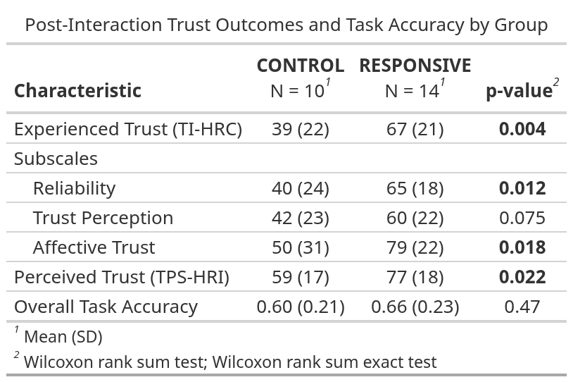
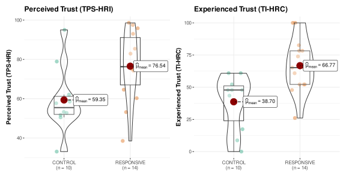
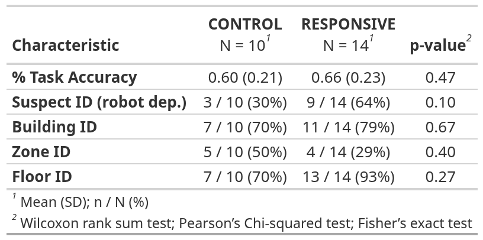

```{r}
#| eval: false
{width="50%"}
```

# Introduction

Trust is essential for effective human-robot collaboration (HRC). Most prior HRI research uses Wizard-of-Oz control or scripted interactions — shielding participants from the errors and breakdowns that define real autonomous systems. Speech recognition failures, delayed responses, and misinterpretations are not peripheral issues: they are defining features of deployed robots, and likely shape trust in ways that scripted studies cannot reveal.

{width="70%"}

\
This pilot study addresses that gap by examining how interaction policy shapes trust under fully autonomous, affect-adaptive spoken dialogue using the Misty II social robot. We compared a proactive, affect-responsive policy — one that adapted its assistance and dialogue based on inferred user state — against a reactive, task-focused policy that responded only when prompted. Because all dialogue management operated without human intervention, participants were exposed to the real latency, recognition errors, and breakdowns that scripted studies conceal.

# Method

**Participants:** N = 29 recruited; 24 eligible after exclusions for sustained communication failure

**Robot Platform:** Misty II social robot

- Real-time pipeline: speech recognition → emotion inference (DistilRoBERTa) → affect-adaptive dialogue generation (Gemini) → embodied robot response
- No human intervention during sessions

**Design: Between-subjects**

- **Responsive Policy:** Proactive, affect-adaptive assistance — empathy, encouragement, and collaborative language based on inferred interaction state
- **Control Policy:** Reactive, task-focused responses only; assistance provided only when explicitly requested

**Collaborative Tasks:**

1.  Robot-dependent suspect identification (5 min, enforced collaboration)
2.  Optional-collaboration location puzzle (10 min, voluntary collaboration)

**Measures:**

- Trust in Industrial HRC (TI-HRC) — experienced/affective trust formed during interaction
- Trust Perception Scale-HRI (TPS-HRI) — retrospective perceived reliability
- Task accuracy
- Dialogue coding (interaction quality, communication breakdown rate)

# Primary Analysis

## Responsive Policy Increased Trust (eligible sample, n = 24)

\

::: {.block fill=rgb("#e8efedff") inset="10pt" radius="4pt"}
**Responsive vs. Control (eligible sample, n = 24):**

- **+26 points on Experienced Trust** (TI-HRC), p = .004 (affective, embodied trust formed during interaction)
- **+15 points on Perceived Trust** (TPS-HRI), p = .022 (retrospective reliability judgements)
- Both effects held after controlling for baseline robot attitudes (NARS)
- Effects were **independent of task accuracy** (p = .47)
:::

{width="80%"}

::: {.block fill=rgb("#e8efedff") inset="10pt" radius="4pt"}

**Bayesian analysis confirmed both effects with high certainty: people tended to trust the responsive robot more, regardless of how they felt about robots going in.**

:::

{width="90%"}

\

## Task Performance: No Significant Difference

\
Overall task accuracy did not differ between conditions (60% vs. 66%, p = .47), suggesting trust was shaped by interaction quality, not task outcomes. While the robot-dependent task showed a descriptive advantage for the Responsive condition (64% vs. 30%) it did not reach significance at this sample size.

{width="60%" align="center"}

# Exploratory Mechanism Analysis

## Communication Viability as a Boundary Condition (full sample, n = 29)

\
Despite requiring English fluency, five sessions were dominated by speech recognition failures and excluded from primary analyses. Exploring the full sample showed the two trust measures responded differently to breakdown: experienced trust eroded as communication failed, while perceived reliability remained relatively stable — suggesting it anchors on moments of successful exchange rather than sustained interaction quality.

# Takeaways

::: {.block fill=rgb("#e8efedff") inset="15pt" radius="4pt"}
- Robots that proactively adapt to users, offering unprompted help and empathy, were rated more trustworthy than robots that only react, independent of task accuracy
- In-the-moment experienced trust (TI-HRC) eroded faster than retrospective perceived reliability (TPS-HRI) as communication failed, suggesting these dimensions reflect distinct aspects of collaborative experience
- The trust advantage of responsive robots degrades as communication breaks down, suggesting reliable communication is a prerequisite for the effect, not just a contributing factor
- Studying trust under real autonomy exposes constraints that Wizard-of-Oz designs conceal and that matter for deployment
:::


# Limitations


```{=typst}
#grid(
  columns: (3fr, 1fr), // Creates two columns of equal width (1 fraction of available space)
  gutter: 0.3em,         // Adds a gap between columns
  [
    // --- Left Column: Text ---
    This pilot used a modest eligible sample (n = 24) with semi-random condition assignment, limiting statistical power for higher-order effects. In addition, the responsive policy represents a bundled interaction profile; future work should disentangle affect-adaptation from increased dialogue exposure and session duration. Spoken-language proficiency variability among participants produced non-viable sessions that required exclusion, which may have introduced selection bias. This highlights the need for adaptive policies that detect emerging breakdown rather than assuming linguistic competence. These findings are exploratory and intended to inform a larger confirmatory study. *Scan the QR code to view full paper.*
  ],
  [
    // --- Right Column: Image ---
    
    #align(center)[
      #image("images/qrcode.svg", width: 80%)] // Replace with your image path
  ]
)
```
